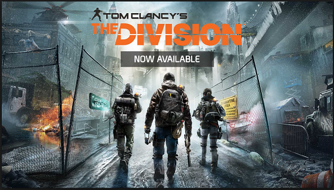
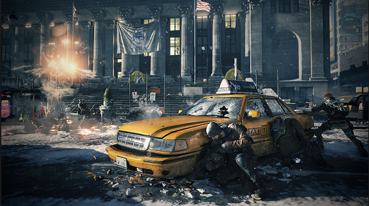
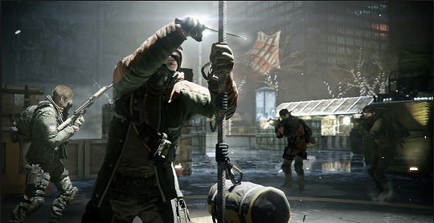

=============
The Division
=============

Overview
========
The game is a third person shooter.

First Person vs Third person
----------------------------

First Person
^^^^^^^^^^^^
::
	In a first person game the player
is portrayed as the person with the
 weapon
Third person
^^^^^^^^^^^^
::
	In a third person game, the player
see the person wioth the weapon and
 directs their actions

Object of the game
==================
*The list below are the objectives*
-----------------------------------
	* Collect loot to improve ranking
	* move contaminated loot to the extraction
	* dont get killed

The Dark zone
=============
+------------------------+----------+----------+----------+
| Dark zone score        | Rookie   | Pro      | expert   |
+========================+==========+==========+==========+
| Blue tag               | 100      | 200      | 300      |
+------------------------+----------+----------+----------+
| Red Tag                | 100      | 200      | 300      |
+------------------------+----------+----------+----------+

Collecting loot
===============
::
To find out more about loot follow `the link`_.
to the `Division web site <http://tomclancy-thedivision.ubisoft.com/game/en-us/home/>`_
.. _the link: http://example.com/

.. image:: ./images/d4.PNG

The Enemy
=========
::
**They are multiple enemies in the game, but avoid the cleaners**

.. image:: ./images/d5.PNG